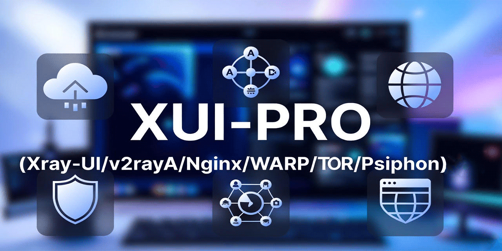

# NovaNetX 3X-Pro — Auto-Provisioned VLESS Proxy Server

> **Developed & Maintained by [Shanudha Tirosh](https://github.com/ShanudhaTirosh)**

**NovaNetX 3X-Pro** is an automated, lightweight, and high-security web proxy server setup script. It integrates **3x-ui**, **Xray-core**, **Nginx**, **Cloudflare WARP/Psiphon**, and **Tor** into a unified, zero-configuration deployment solution operating on **Port 443** with **Standard TLS**.

---

## 🌟 Key Features

- ⚡ **Auto-Provisioned NovaNetX Inbounds**: Automatically creates and configures pre-tested VLESS inbounds on Port 443 upon installation.
- 🔒 **Standard TLS Security (`security=tls`)**: Uses Let's Encrypt SSL/TLS certificates with automated auto-renewal.
- 🚀 **Port 443 Dual Coexistence**: Handles direct VLESS TCP Vision traffic and WebSocket traffic on port 443 via Nginx proxying.
- 🌐 **Cloudflare CDN Ready**: Fully compatible with Cloudflare CDN and clean Cloudflare Anycast IPs (e.g. `172.66.40.229`).
- 🛡️ **Built-in Security & DPI Evasion**: Evasion techniques including SNI camouflage (`zoom.us`) and random HTML fake site templates.
- 🔄 **Automated Daily Backups & SSL Renewal**: Auto-renews certificates and backs up `x-ui.db` to `/var/backups`.

---

## ⚡ Quick Installation Command

Run the following command on your fresh Linux server (Ubuntu/Debian/CentOS/AlmaLinux):

```bash
sudo su -c "$(command -v apt||echo dnf) -y install wget; bash <(wget -qO- https://raw.githubusercontent.com/ShanudhaTirosh/3xpro/main/x-ui-pro.sh) -panel 1 -xuiver last -cdn off -secure no -country xx"
```

### 📖 Command Breakdown & Explanation

| Parameter / Flag | Meaning & Function |
|---|---|
| `sudo su -c "..."` | Executes the installer with **root privileges** required to set up systemd services, Nginx, UFW, and SSL certs. |
| `$(command -v apt\|\|echo dnf) -y install wget` | Automatically detects your Linux package manager (`apt` or `dnf`) and installs `wget`. |
| `bash <(wget -qO- ...)` | Downloads and streams the latest `x-ui-pro.sh` script directly into Bash. |
| **`-panel 1`** | Installs **3x-ui** (by MHSanaei) as the web administration panel. |
| **`-xuiver last`** | Installs the **latest stable release** of 3x-ui. |
| **`-cdn off`** | Disables strict CDN IP restrictions so direct VPS connections and Cloudflare connections are allowed. |
| **`-secure no`** | Disables strict User-Agent filtering so all proxy apps (V2rayN, v2rayNG, Shadowrocket, Sing-Box) can connect easily. |
| **`-country xx`** | **No Country Restriction!** Allows incoming connections from **ALL countries worldwide** (`xx` = no restriction). |

---

## ☁️ Cloudflare Setup & Proxy Status (Orange vs Grey Cloud)

### ❓ Is Enabling Cloudflare Proxy Status (Orange Cloud 🧡) a Problem?

**No! Enabling Cloudflare Proxy Status is NOT a problem.** Here is how each inbound behaves with Cloudflare Proxy Status:

| Inbound | Transport | Cloudflare Proxy Status | Behavior / Recommendation |
|---|---|---|---|
| **`NovaNetX-VLESS-WS`** | WebSocket (`ws`) | **Orange Cloud 🧡 (Proxied)** | **Recommended!** Hides your real VPS IP address and routes WebSocket traffic through Cloudflare CDN. Works perfectly with Cloudflare clean IPs (`172.66.40.229:443`). |
| **`NovaNetX-VLESS`** | TCP + Vision | **Grey Cloud ⚙️ (DNS Only) or Direct IP** | Requires raw TCP connection. Connects directly to server IP or a DNS-Only subdomain for maximum performance and XTLS-Vision flow control. |

---

### Step-by-Step Cloudflare Setup Guide

#### Step 1: Recommended DNS Records Setup
In your [Cloudflare Dashboard](https://dash.cloudflare.com/), add two DNS A records for optimal performance:

1. **Record 1 — For WebSocket CDN (`NovaNetX-VLESS-WS`):**
   - **Type:** `A`
   - **Name:** `vpn` (e.g. `vpn.yourdomain.com`)
   - **IPv4 address:** `YOUR_SERVER_IPV4_ADDRESS`
   - **Proxy status:** **`Proxied` (Orange Cloud 🧡)**

2. **Record 2 — For Direct TCP-Vision (`NovaNetX-VLESS`) & SSL Issuance:**
   - **Type:** `A`
   - **Name:** `direct` (e.g. `direct.yourdomain.com`)
   - **IPv4 address:** `YOUR_SERVER_IPV4_ADDRESS`
   - **Proxy status:** **`DNS Only` (Grey Cloud ⚙️)**

#### Step 2: SSL/TLS Encryption Mode
Go to **Cloudflare Dashboard > SSL/TLS > Overview**:
- Set mode to **Full** or **Full (Strict)**.

#### Step 3: Network Settings
Go to **Cloudflare Dashboard > Network**:
- **WebSockets:** Set to **ON** *(Required for `NovaNetX-VLESS-WS`)*.
- **gRPC:** Set to **ON** *(Recommended)*.

#### Step 4: Connecting via Cloudflare Clean IP
In your VLESS client app (V2rayN, v2rayNG, Shadowrocket, Sing-Box):
- Set **Address:** `172.66.40.229` (Cloudflare Clean IP)
- Set **Port:** `443`
- Set **SNI & Host:** `vpn.yourdomain.com`

---

## 📊 Auto-Generated NovaNetX Inbounds Summary

The installation script automatically generates and prints the following two ready-to-use VLESS links:

### 1. `NovaNetX-VLESS` (VLESS + TCP + XTLS-Vision + TLS)
- **Protocol:** VLESS
- **Port:** `443`
- **Transport:** `tcp`
- **Flow:** `xtls-rprx-vision`
- **Security:** `tls`
- **SNI:** `zoom.us`
- **Format:**
  ```text
  vless://<UUID>@direct.yourdomain.com:443/?encryption=none&flow=xtls-rprx-vision&security=tls&fp=chrome&sni=zoom.us&type=tcp&headerType=none#NovaNetX-VLESS
  ```

### 2. `NovaNetX-VLESS-WS` (VLESS + WebSocket + TLS + Cloudflare CDN)
- **Protocol:** VLESS
- **Port:** `443` (Proxied via Nginx)
- **Transport:** `ws` (WebSocket)
- **Path:** `/`
- **Host / SNI:** `vpn.yourdomain.com`
- **Cloudflare Address:** `172.66.40.229`
- **Security:** `tls`
- **Format:**
  ```text
  vless://<UUID>@172.66.40.229:443/?encryption=none&flow=none&security=tls&fp=chrome&sni=vpn.yourdomain.com&type=ws&host=vpn.yourdomain.com&headerType=none&path=%2f#NovaNetX-VLESS-WS
  ```

---

## 🛠️ Management & Useful Script Arguments

### Random Fake HTML Site Template
```bash
bash <(wget -qO- https://raw.githubusercontent.com/ShanudhaTirosh/3xpro/main/x-ui-pro.sh) -RandomTemplate yes
```

### Enable UFW Firewall
```bash
bash <(wget -qO- https://raw.githubusercontent.com/ShanudhaTirosh/3xpro/main/x-ui-pro.sh) -ufw on
```

### Uninstall NovaNetX 3X-Pro
```bash
bash <(wget -qO- https://raw.githubusercontent.com/ShanudhaTirosh/3xpro/main/x-ui-pro.sh) -Uninstall yes
```

---

## ❤️ Credits & Acknowledgments

- **Lead Developer & Maintainer**: [Shanudha Tirosh](https://github.com/ShanudhaTirosh)
- **Upstream Project & Inspiration**: GFW4Fun (`x-ui-pro`)
- **Web UI & Core Developers**: [3x-ui / MHSanaei](https://github.com/mhsanaei/3x-ui), [Xray-core / XTLS](https://github.com/XTLS/Xray-core), [v2rayA](https://github.com/v2rayA/v2rayA)

---

*Made with ❤️ by [Shanudha Tirosh](https://github.com/ShanudhaTirosh)*
